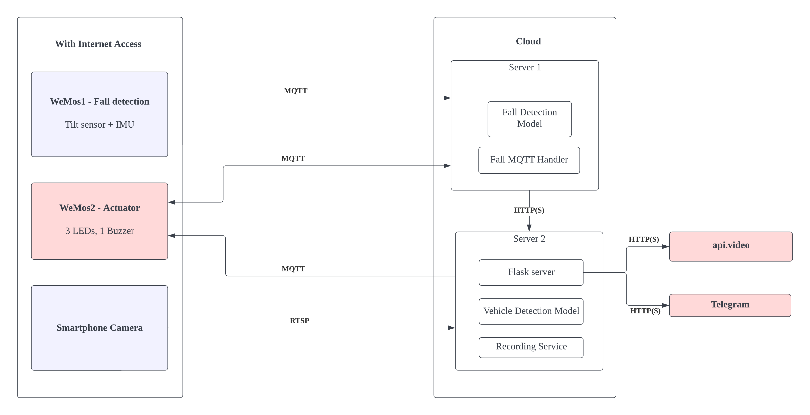

# CycleSafe

## Introduction

https://user-images.githubusercontent.com/64767959/206710205-fe706b10-0ff5-46b9-931f-0297390d0618.mp4

Amid a COVID-19-inspired boom in the popularity of cycling, the number of road traffic accidents involving bicycles has since increased. An average of about 560 serious accidents involving cyclists on roads have been recorded yearly in the past five years. Accidents usually happen due to negligent drivers and the inconvenience of the cyclists to constantly check the situation behind and in blind spots. These accidents are dangerous and possibly life-threatening, particularly for cyclists compared to drivers. Furthermore, some injured cyclists face difficulties in contacting for help, and this issue is magnified when there is no one around to help them.

Our proposed solution, hence, aims to minimise the negative consequences of cycling accidents and reduce the chances of these accidents by introducing a comprehensive Internet of Things (IoT) system. This system comprises three main components: vehicle detection, fall detection, and an alarm system.

**Fall Detection**

When cyclists fall, they might be left attended or the neighboring vehicles might not notice the cyclist lying on the ground, which may cause vehicles to run over them. To avoid this dangerous situation, we have attached a fall detection module to the bicycle to detect collisions and falls and alert the surroundings to help drivers notice the fallen cyclist more easily. At the same time, we have proposed a telegram bot to help notify the cyclist's family members and friends concerned with the cyclist's safety. Most recent recordings regarding the fall will also be uploaded to provide further confirmation.

**From Fall Detection to Fall Prevention**

While cyclists can observe the road conditions most of the time, blindspots are usually neglected and leave cyclists unaware of approaching vehicles. Our IoT system plans to attach a smartphone camera to detect vehicles in blind spots using computer vision and keep the cyclists wary of the presence of their surrounding vehicles, the vehicles’ speed and the proximity between the cyclist and these vehicles. The camera will also serve as a dashcam to record the vehicles behind in the case of a hit-and-run.

## Techniques employed

### System Architecture

As seen from the diagram, the system architecture is made up of two primary components: the edge devices and the cloud.

Our edge devices consist of the first WeMos which is used for fall detection, a smartphone camera and a second WeMos for the actuators. Fall detection requires the use of two tilt switches and an inertial measurement unit (IMU). Data from these sensors will subsequently be sent to the cloud via Message Queuing Telemetry Transport (MQTT). For vehicle detection, video data from the smartphone is sent to the cloud via Real Time Streaming Protocol (RTSP). The second WeMos is used for the actuators, which are the three LEDs and one buzzer. Data used to toggle the buzzer is both received from and transmitted to a server in the cloud (used for fall detection) whereas the data used for the three LEDs originates from another server in the cloud (used for vehicle detection). All these edge devices require Internet access for data transmission.

The cloud component comprises two servers; Server 1 is used for fall detection, and Server 2 is used for vehicle detection. The fall detection model and fall MQTT handler are found in Server 1, which will also relay information to Server 2 using HTTPS for Telegram notification purposes. The Vehicle Detection Model, Flask server and Recording Service are hosted on Server 2. The Flask server is used to output the Telegram messages and videos (api.video) from the point of view of the bicycle’s rear to a Telegram channel, and this is executed via HTTP(S). Depending on the different events that occur, different Telegram messages and videos will be published in the Telegram channel where individuals concerned with the safety of the cyclist can subscribe to.

### Main Techniques

**Communication**

- Messaging Queueing Telemetry Transport (MQTT) with Transport Layer Security (TLS) Encryption for communication between the WeMoses, Cloud and Telegram server
- Real Time Streaming Protocol (RTSP) to transmit smartphone camera data to the cloud

**Fall Detection**

- The model is trained with Multilayer Perceptron (MLP) and saved
- Prediction is performed in the cloud with the saved model to detect falling events

**Vehicle Detection**

- A pre-trained Tiny - YOLOv3 model is used to detect vehicles
- An algorithm is used to detect the changes of size of vehicles between each frames to determine the safety status
- The video stream obtained is recorded and saved in 10 seconds chunk, and most recent 20 videos are kept

**Miscellaneous**

- 3D printed case to contain all the actuators and sensors
- Smartphone camera for obtaining video stream of incoming vehicles and for video recording
- Sensors: IMU (MPU-9250/6500), 2 tilt switches
- Actuators: 1 Buzzer, 3 LEDs, a telegram bot that notifies those who are concerned with the cyclist’s most recent statuses
